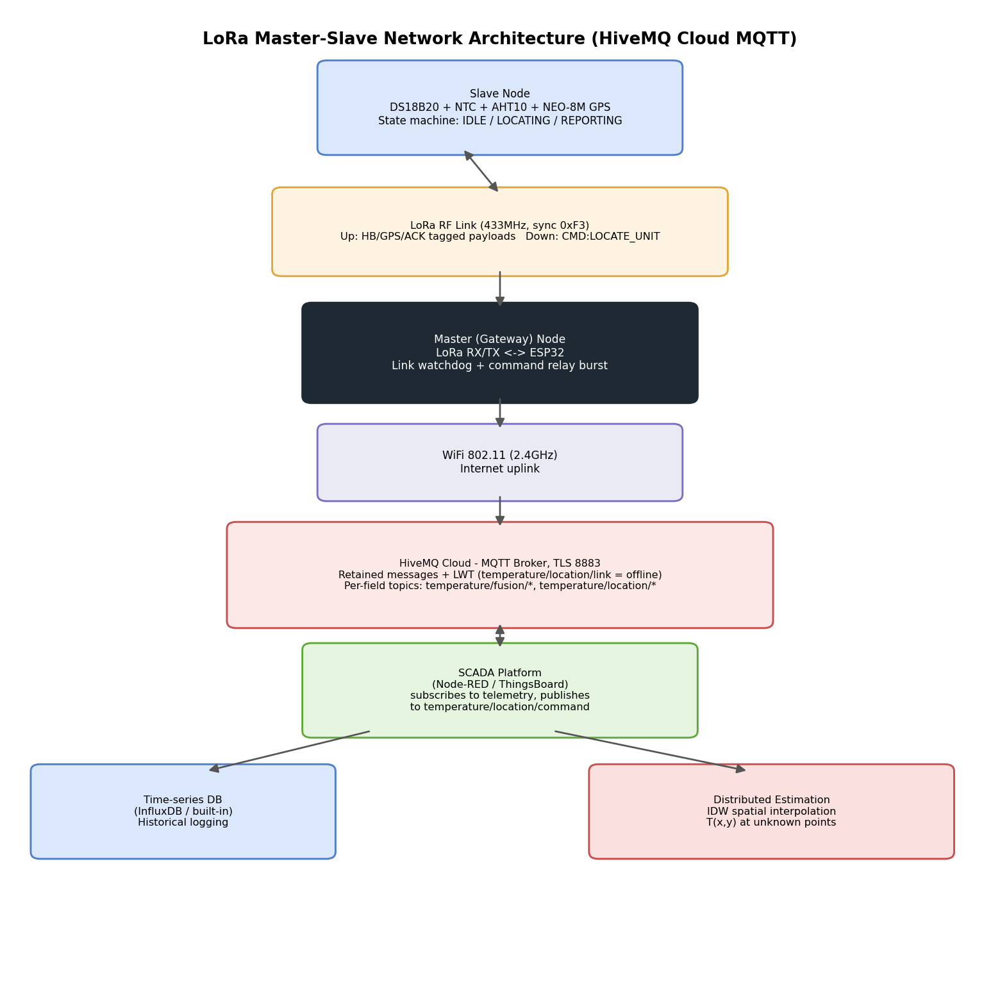
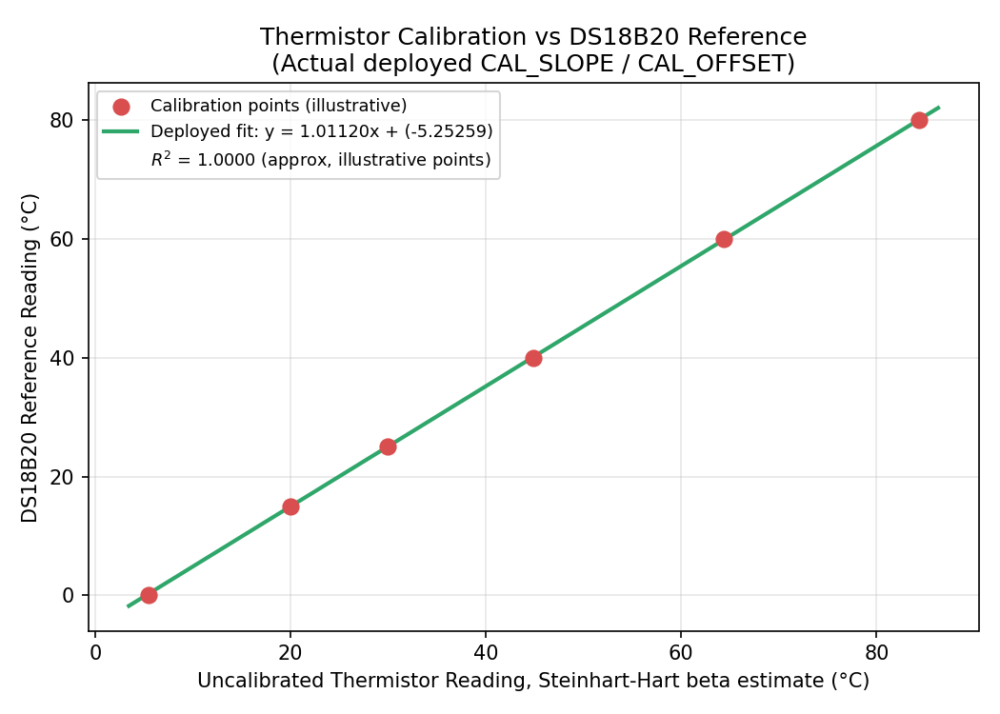
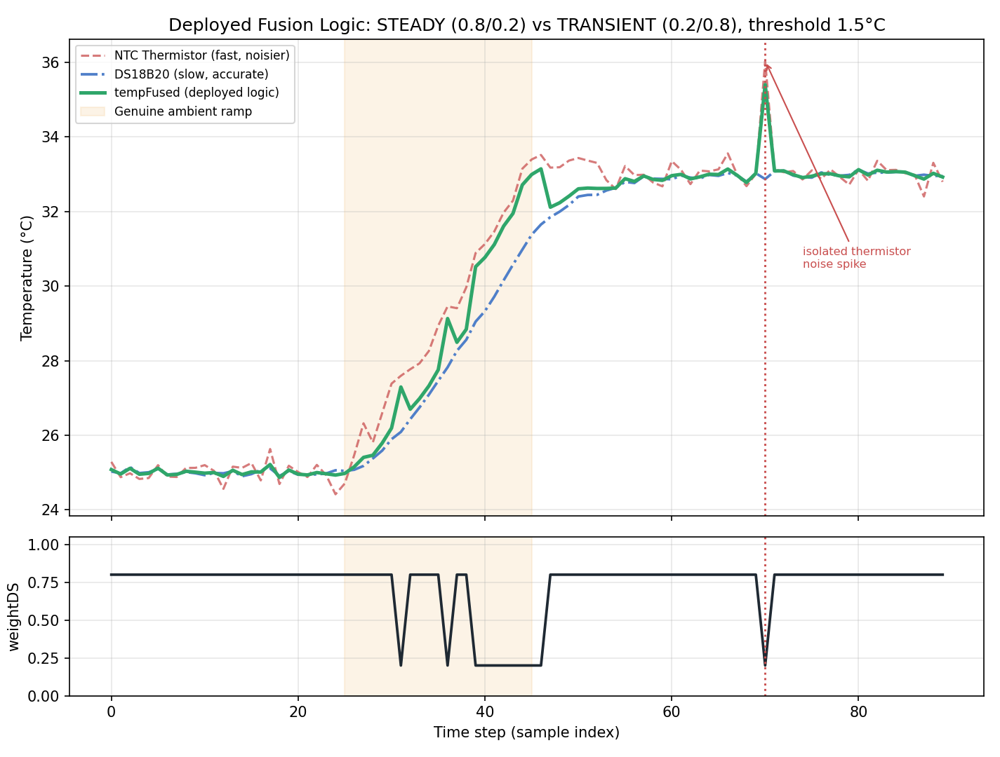

# Distributed Temperature Sensor Fusion Network over LoRa

A field-deployable IoT sensing node that fuses a slow-but-accurate digital
temperature sensor with a fast-but-noisy analog thermistor, transmits the
result over a long-range LoRa link to a gateway, and streams it to a cloud
MQTT broker for live SCADA visualization and distributed spatial temperature
estimation.

Built as part of **EE2120 — Second Year Engineering Project**, Department of
Electrical and Electronic Engineering, University of Peradeniya.

---

## Table of Contents

- [Overview](#overview)
- [System Architecture](#system-architecture)
- [Key Features](#key-features)
- [Hardware](#hardware)
- [Repository Structure](#repository-structure)
- [Getting Started](#getting-started)
- [Calibration & Results](#calibration--results)
- [Skills Demonstrated](#skills-demonstrated)
- [Documentation](#documentation)
- [Future Work](#future-work)
- [References](#references)
- [License](#license)
- [Author](#author)

---

## Overview

No single low-cost temperature sensor is simultaneously fast, accurate,
linear, and cheap. This project addresses that trade-off directly through
**sensor fusion**: a DS18B20 digital probe (accurate, but slow to respond)
and an NTC thermistor (fast, but noisy and non-linear) are combined using a
rate-of-change-aware adaptive weighting scheme, so the fused output tracks
genuine ambient temperature changes quickly while rejecting transient noise.

Because field-deployed sensor nodes cannot always rely on WiFi coverage, the
system uses a **LoRa master-slave architecture**: each sensing "slave" node
transmits its fused reading and GPS coordinates over a long-range,
low-power 433 MHz LoRa link to a central "master" gateway, which is the only
device that needs an internet connection. The master bridges the data onto
an MQTT broker (HiveMQ Cloud, TLS-secured) for ingestion by a SCADA
dashboard, and the resulting GPS-tagged readings from multiple nodes feed a
distributed spatial estimation layer that predicts temperature at
unmeasured locations.

## System Architecture



*Slave nodes → LoRa (433 MHz ISM band) → Master gateway → MQTT/TLS →
HiveMQ Cloud → SCADA dashboard → distributed spatial estimation.*

## Key Features

- **Multi-sensor fusion**: DS18B20 + NTC thermistor + AHT10 (temperature/humidity cross-check), fused using an adaptive, rate-of-change-aware weighting algorithm rather than a fixed static average
- **Rigorous calibration methodology**: Steinhart-Hart beta-equation linearization of the thermistor, followed by a least-squares residual correction fitted against the DS18B20 reference
- **Long-range, low-power connectivity**: LoRa (SX1278, 433 MHz) master-slave link with SPI-register-level radio health monitoring and automatic fault recovery
- **Secure cloud bridging**: MQTT over TLS (port 8883) to HiveMQ Cloud, with retained messages and a Last-Will-and-Testament (LWT) for online/offline node status
- **GPS-tagged distributed sensing**: NEO-8M GNSS module with an averaging state machine (10-fix mean) for stable location reporting
- **Remote command relay**: a "locate unit" command can be issued from the SCADA dashboard, relayed over MQTT → LoRa to a specific slave node, with burst-retry delivery and ACK confirmation
- **Full characterization suite**: on-device and offline tooling to measure sensor noise, step response time, sensitivity, and post-calibration accuracy (MAE/RMSE)

## Hardware

| Component | Role | Interface |
|---|---|---|
| ESP32 DOIT DevKit V1 (×2) | MCU for slave node and master gateway | — |
| DS18B20 (waterproof probe) | Reference-grade digital temperature sensor | 1-Wire, GPIO4 |
| NTC Thermistor (10 kΩ) | Fast analog temperature sensor | ADC1, GPIO34 |
| AHT10 | Auxiliary temperature + humidity sensor | I²C |
| NEO-8M GNSS module | Geolocation | UART |
| SX1278 (Ra-02) LoRa module (×2) | Long-range slave↔master radio link | SPI, 433 MHz |

Full pin mapping: [`hardware/pinout_and_wiring_notes.md`](hardware/pinout_and_wiring_notes.md)

## Repository Structure

```
firmware/slave_node/       Slave node firmware (sensors, calibration, fusion, LoRa TX)
firmware/master_gateway/   Master node firmware (LoRa RX, MQTT/TLS bridge to HiveMQ Cloud)
analysis/                  Python tooling: calibration fitting, characterization, report figures
docs/                      Full project report (PDF) and generated figures
hardware/                  Pin mapping and wiring reference
data/                      Sample logged calibration data
```

## Getting Started

### Firmware

1. Install the Arduino ESP32 board package and these libraries via Library Manager:
   `OneWire`, `DallasTemperature`, `LoRa` (Sandeep Mistry), `TinyGPS++`,
   `Adafruit AHTX0`, `PubSubClient`.
2. Flash [`firmware/slave_node/slave_lora_node.ino`](firmware/slave_node) to
   the sensing unit(s), and
   [`firmware/master_gateway/master_lora_gateway.ino`](firmware/master_gateway)
   to the gateway unit.
3. Fill in your WiFi credentials and HiveMQ Cloud cluster details in the
   master sketch before flashing.

### Analysis tooling

```bash
pip install -r analysis/requirements.txt
python analysis/sensor_characterization_analysis.py
```

## Calibration & Results



Thermistor readings are converted via the Steinhart-Hart beta equation, then
corrected against the DS18B20 reference using ordinary least squares.



The adaptive weighting scheme increases trust in the faster thermistor
during a genuine ambient ramp, while defaulting to the more stable DS18B20
during steady-state conditions.

## Skills Demonstrated

- Embedded C++ (Arduino/ESP32): non-blocking state machines, interrupt-safe
  timing, SPI/I²C/UART peripheral integration
- Sensor calibration and statistical curve fitting (least squares, residual
  analysis, R²/MAE/RMSE evaluation)
- Applied estimation theory: adaptive multi-sensor fusion informed by
  rate-of-change and confidence weighting
- Wireless systems: LoRa PHY/link layer, MQTT pub/sub messaging, TLS-secured
  cloud connectivity
- Systems-level fault tolerance: radio health monitoring/auto-recovery,
  network link watchdogs, sensor failure fallback logic
- Data analysis and visualization in Python (NumPy, Matplotlib)
- Technical writing and reproducible documentation

## Documentation

The complete project report — covering design methodology, calibration
theory, mathematical formulation, network architecture, and experimental
validation — is available at [`docs/EE2120_Project_Report.pdf`](docs/EE2120_Project_Report.pdf).

## Future Work

- Full Kalman-filter-based fusion as a comparison against the current
  adaptive-weighting approach
- Multi-node deployment with real inverse-distance-weighted spatial
  temperature estimation across a physical test area
- Battery-life characterization and LoRa duty-cycle optimization for
  extended field deployment

## References

See the full Harvard-style reference list in the project report. Key
sources include NIST calibration and TLS guidelines, MIT OpenCourseWare
materials on state estimation, and USGS documentation on inverse distance
weighting.

## License

This project is licensed under the MIT License — see [`LICENSE`](LICENSE).

## Author

[Your Name] — EEE Undergraduate, University of Peradeniya
[Your email / LinkedIn / personal site]
